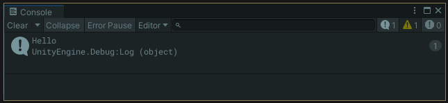

# Debug 101 CheatSheet

### Debug.Log();

- Use `Debug.Log();` to help you identify errors or to gain helpful information about your scripts

```csharp
Debug.Log("Hello");
```

```csharp
String welcomeString = "Hello";
Debug.Log(welcomeString);
```



You can also debug any value just as the `welcomeString` variable from above.

```csharp
Vector3 alphaVector = Vector3.one;
Debug.Log(alphaVector.x);
```


### Errors & Warnings

- There are also `LogWarning();`and `LogError();` for important logs

```csharp
Debug.LogWarning("Warning");
Debug.LogError("Error");
```


### Debug.Break();

- Will force the editor to ⏯️`Pause` at end of that frame.
    
    
    

```csharp
				if(Input.GetMouseButtonDown(0)){
            //FireRocket
            Instantiate(rocketPrefab);
						Debug.Log("<color=orange>RocketFired!</color>");
						Debug.Break();
        }
```


### Context

- Seen without context a log tells us a Raycast ***somewhere*** has hit

```csharp
Debug.Log("The Raycast Hit");
```


---

- Using the 2nd parameter of `Debug.Log()` we can for ex. see ***which*** Raycast has hit

```csharp
Debug.Log("The Raycast Hit", this);
```


- Double-click the Debug Log in the `Console` to highlight the *object* that we passed in

### String Interpolation

- We can combine strings and other data like,

```csharp
Debug.Log("We hit: " + hit.transform.name);
```

- but by using String Interpolation it looks like,

```csharp
Debug.Log($"We hit: {hit.transform.name}");
```


```csharp
Debug.Log($"For just, {centsAmnt} cents, we found {amnt} {fruitType} at the market");
```

***vs*** the “ **“ “ + var + “ “ + var**, and don’t forget your spaces” routine
