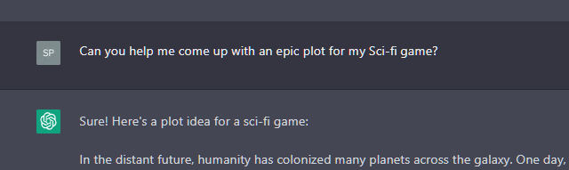
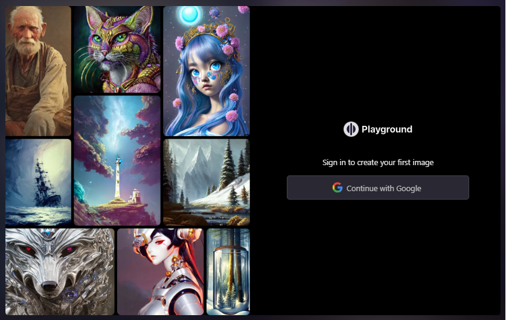

## ChatGPT
A chatbot developed by OpenAI and launched in November 2022.

Use it to help guide your game development such as structuring a game system or brainstorming an epic plot twist.

[www.openai.com](https://openai.com/)

## Playground AI is a free-to-use online AI image creator.

Use it to create art, social media posts, presentations, posters, videos, logos and more.

[www.playgroundai.com](https://www.playgroundai.com/)
