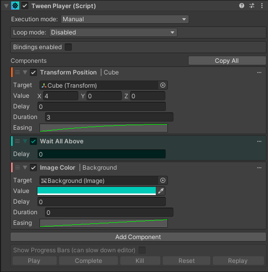

### NaughtyAttributes is an extension for the Unity Inspector.
It expands the range of attributes that Unity provides so that you can create powerful inspectors without the need of custom editors or property drawers. It also provides attributes that can be applied to non-serialized fields or functions.


https://assetstore.unity.com/packages/tools/utilities/naughtyattributes-129996


### Juce Tween Component
An interpolation animation tool aimed to increase your productivity. It allows you to easily create complex tween sequences directly from the editor. No boilerplate, no coding, just plain fun!
Easy to use: just add the Tween Player component to any GameObject, and start animating properties!



https://github.com/Juce-Assets/Juce-TweenPlayer


### Debug.Log() Extended Colors
Just a simple extension method of Unity's `Debug` class. Bring a little fun into your debugging.
I use different color logs to know, at a glance, what system I'm dealing with.


```        
        UnityEngine.Debug.Log("Factory Debug");
        Debug.Log("Aftermarket Debug");
        Debug.Red("Red Debug");
        Debug.Orange("Orange Debug");
        Debug.Yellow("Yellow Debug");
        Debug.Green("Green Debug");
        Debug.Blue("Blue Debug");
        Debug.Indigo("Indigo Debug");
        Debug.Violet("Violet Debug");
        Debug.Error("Error Debug");
        Debug.Warning("Warning Debug");
        Debug.Underlined("Underlined Debug");
```
https://github.com/SpawnCampGames/Resources/blob/main/Editor/Debug.cs


