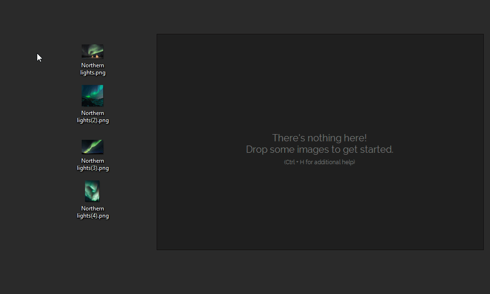
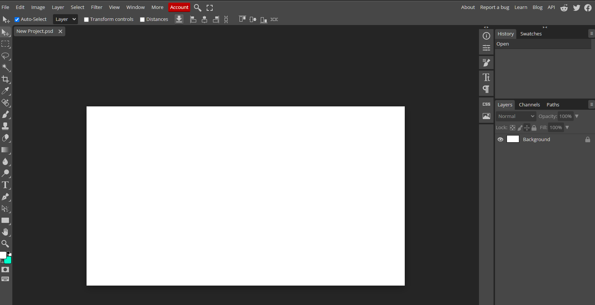

## Blender is a free and open source powerful and capable 3D modelling software.

Rendering, Modelling, VFX, Animation & Rigging, 2D/3D Drawing, Python Interface, etc

[www.blender.org](https://www.blender.org/)

## PureRef is a stand-alone program for Windows, Mac and Linux that keeps track of your images.

Perfect for reference materials or creating mood-boards

[www.pureref.com](https://www.pureref.com/)

## Photopea is a browser-based program for mild to moderate photo editing.

Basically Photoshop in your web browser.

[www.photopea.com](https://www.photopea.com/)

