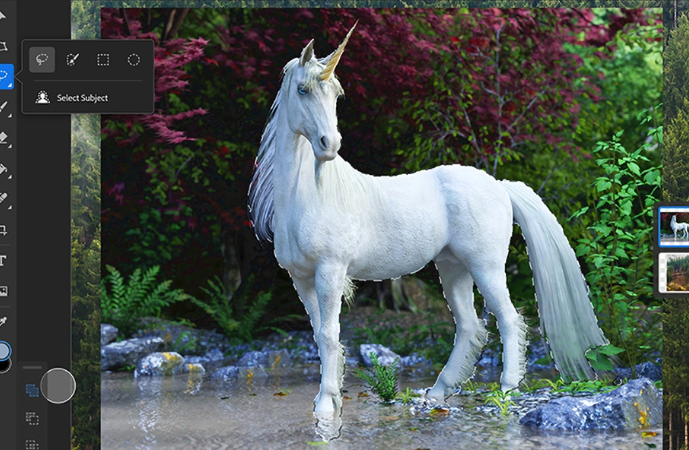

# SpawnCampGame's Developer Suite

## Imaging

## Modelling

## Audio Editing

## Video Editing

## Misc

### Blender

A free and open source powerful and capable 3D modelling software.
Rendering, Modelling, VFX, Animation & Rigging, 2D/3D Drawing, Python Interface, etc

[www.blender.org](https://www.blender.org/)

### Photoshop

Under Rock Recap: Photoshop is an image creation, graphic design and photo editing software developed by Adobe.

[www.adobe.org](https://www.adobe.com/products/photoshop.html) [Free 7-day Trial]

### Audacity

An easy-to-use, multi-track audio editor and recorder for Windows, macOS, GNU/Linux and other operating systems.

[www.audacityteam.org/](https://www.audacityteam.org/)

### PureRef

A stand-alone program for Windows, Mac and Linux that keeps track of your images.
Perfect for reference materials or creating mood-boards

[www.pureref.com](https://www.pureref.com/)

### Photopea

A fully capable browser-based program for mild to moderate photo editing.
Basically Photoshop in your web browser.

[www.photopea.com](https://www.photopea.com/)
