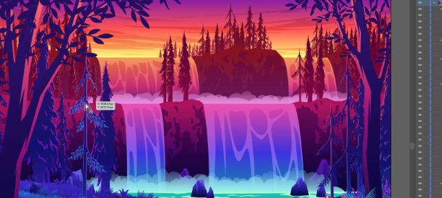
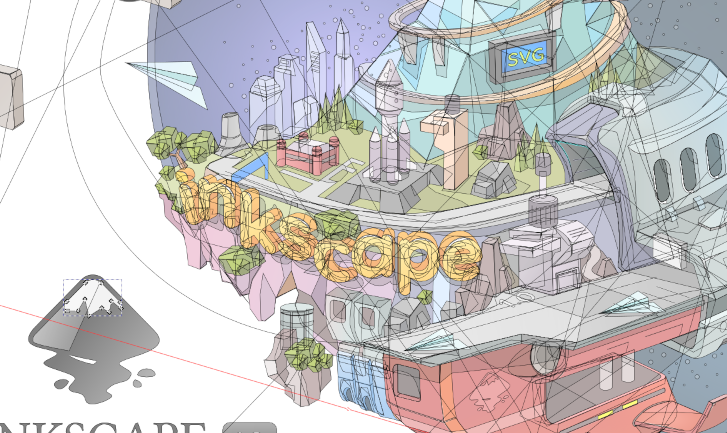
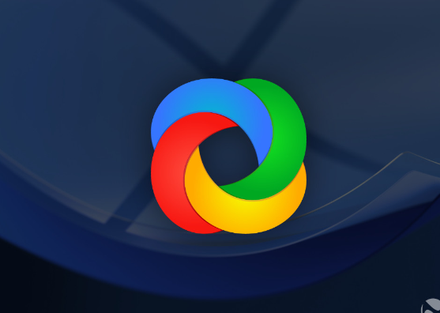

# SpawnCampGame's Developer Suite

### Image and Graphic Design
#### Raster Art

##### Photoshop

Under Rock Recap: Photoshop is an image creation, graphic design and photo editing software developed by Adobe.

[www.adobe.com](https://www.adobe.com/products/photoshop.html) [Free 7-day Trial]

##### Photopea

A fully capable browser-based program for mild to moderate photo editing.
Basically Photoshop in your web browser.

[www.photopea.com](https://www.photopea.com/)

##### Gimp

Under Rock Recap: It's the free version of Photoshop
A cross-platform image editor available for GNU/Linux, macOS, Windows and more. It is free software and open source.

[www.gimp.org](https://www.gimp.org/)

#### Vector Art

##### Illustrator

The "best" software for creating drawings, illustrations and artwork using a Windows or MacOS computer.

[www.adobe.com/](https://www.adobe.com/products/illustrator.html) [Free 7-day Trial]

##### Inkscape

A professional quality vector graphics software which runs on Linux, Mac OS X and Windows desktop computers.
(Free alternative to Adobe Illustrator)

[www.inkscape.org](https://www.inkscape.org/)

### Modelling / 3D Software

##### Blender

A free and open source powerful and capable 3D modelling software.
Rendering, Modelling, VFX, Animation & Rigging, 2D/3D Drawing, Python Interface, etc

[www.blender.org](https://www.blender.org/)

### Audio Editing
##### Audacity

An easy-to-use, multi-track audio editor and recorder for Windows, macOS, GNU/Linux and other operating systems.

[www.audacityteam.org/](https://www.audacityteam.org/)

### Video Editing

##### Premiere & After Effects

Yet some more Adobe Products. Premiere is your industry standard type of video editing, while After Effects adds the polish and special effects.

[http://www.adobe.com/products/premiere.html](https://www.adobe.com/products/premiere.html)
[http://www.adobe.com/products/aftereffects.html](https://www.adobe.com/products/aftereffects.html)

##### HitFilmExpress ⭐SpawnFavorite

A free video editing and visual effects software with professional-grade VFX tools for you to make awesome content, films or gaming videos.
Great alternative to Adobe AfterEffects & Premiere!

[www.fxhome.com/product/hitfilm](www.fxhome.com/product/hitfilm)

### Web Developing
#### IDE

##### Notepad++

A free (as in “free speech” and also as in “free beer”) source code editor and Notepad replacement that supports several languages. Running in the MS Windows environment, its use is governed by GNU General Public License.

[www.notepad-plus-plus.org](https://www.notepad-plus-plus.org/)

##### SublimeText

A sophisticated text editor for code, markup and prose (and free). 

[www.sublimetext.com](https://www.sublimetext.com/)

##### Visual Studio Code
Under Rock Recap: A streamlined code editor with support for development operations like debugging, task running, and version control. It aims to provide just the tools a developer needs for a quick code-build-debug cycle and leaves more complex workflows to fuller featured IDEs, such as Visual Studio IDE. 

[https://code.visualstudio.com/](https://code.visualstudio.com/)

#### FTP Client

##### Filezilla

A free and open-source, cross-platform FTP application, consisting of FileZilla Client and FileZilla Server. Clients are available for Windows, Linux, and macOS.

[www.filezilla-project.org](https://filezilla-project.org/)

### Game Design, Organization, and Brain-Storming

##### Notion ⭐SpawnFavorite

A productivity and note-taking web application developed by Notion Labs Inc. It offers organizational tools including task management, project tracking, to-do lists, bookmarking, and more. *Trello on steroids*.

[www.notion.so](https://www.notion.so/)

##### Trello

The ultimate project management tool. Start up a board in seconds, automate tedious tasks, and collaborate anywhere, even on mobile.

[www.trello.com](https://www.trello.com/)

##### Coggle

The clear way to share complex information. A collaborative mind-mapping tool that helps you make sense of complex things.

[www.coggle.it](https://www.coggle.it/)

##### PureRef

A stand-alone program for Windows, Mac and Linux that keeps track of your images.
Perfect for reference materials or creating mood-boards

[www.pureref.com](https://www.pureref.com/)

### Screen Recording

##### Open Broadcaster Software OBS

A short description or maybe a long description for the tool in question.

[www.tool.com](https://www.tool.com/)

##### ShareX
[https://getsharex.com/](https://getsharex.com/)

A free and open source program that lets you capture or record any area of your screen and share it with a single press of a key.
Can create still images or even animated gifs and compression rates are epic.
*Window's Snipping Tool on steroids*

##### Title
[www.tool.com](https://www.tool.com/)

A short description or maybe a long description for the tool in question.

### Sharing
#### Video

##### Streamable

Videos too big to post? Use this website to upload videos and grab a temporary link to share with all your friends.
Or create an account to hang on to em a bit longer with the added benefit of cropping, trimming, and downloading.

[www.streamable.com](https://www.streamable.com/)

##### Gfycat
https://gfycat.com/illiterateangelickatydid

Upload videos here and automatically convert them to gifs complete with embeds that you can share where ever you like.
Even use audio in your gifs to really make a statement!
Create an account to start a portfolio.

[www.gfycat.com/](https://gfycat.com/)

#### Code
There are many times when you'll probably want to share your code. Whether it be, for getting help from others or just showing off a piece of logic you're
particularly proud of. 

https://gist.github.com/
https://hatebin.com/
https://paste.myst.rs/
https://paste.ofcode.org/
https://www.hastebin.com
https://gdl.space/

#### Game
Places to upload your Unity Game

www.itch.io
www.gamejolt.com
www.kbhgames.com
www.crazygames.com
Steam (library)
www.github.com (repo)

*If it's a WebGL build you can host it straght from your github by using your github.io page*
[youname.github.io](https://pages.github.com/)

### Misc

END
